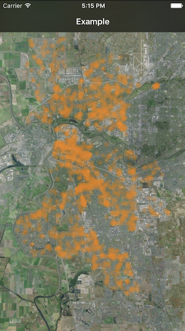

# iOS Density Map

By using OpenGL ES, iOS Density Map allows you to efficiently render thousands of particles over a map.

iOS Density Map has two main components:

GLParticlesRender: Renders all the particles in a eaglcontex. Basically it renders groups of particles with a specific style (GLPariclesStyle).

GLDensityMapView: Provides the eaglcontext and the particles groups info for the GLParticlesRender . The GLDensityMapView provides  a number of properties and blocks that needs to be overwritten in order to display the particles.

## Setup

```Objective-c
- (void)setupDensityMapView{
    
    //Set the number of particles styles (style groups).
    self.densityMapView.styleGroupsCount = 1;
    
    //Return the style for each group.
    self.densityMapView.styleForStyleGroup = ^GLParticlesStyle(GLStyleGroupIndex groupIndex) {
        GLParticlesStyle style = {
            .radius = 7,
            .blurFactor = 0.95,
            .r = 255,
            .g = 130,
            .b = 0,
            .opacity = 0.45,
        };
        return style;
    };
    
    __weak ViewController *wself = self;
    
    //Return the number of particles for each group.
    self.densityMapView.particlesCountForStyleGroup = ^uint(GLStyleGroupIndex groupIndex) {
        return (int)wself.locations.count;
    };
    
    //Retrun the x,y position for each particle
    self.densityMapView.positionForParticle = ^CGPoint(GLParticleIndex pointIndex, GLStyleGroupIndex groupIndex) {
        return  [wself.mapView convertCoordinate:wself.locations[pointIndex].coordinate
                                   toPointToView:wself.view];
    };
}
```

## Example



